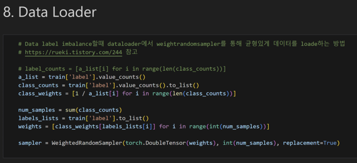

# AI Contest for Classifying wallpapering([link](https://dacon.io/competitions/official/236082/overview/description))

- Development competition for a total of 19 types of wallpapering fail case AI models.
- Applying various augmentation techniques using albumentations for data preprocessing.

- Improving model performance through weighted sampling during training.

- Comparing various image detection models such as EfficientNet, ResNet, and ConNext to derive the optimal model.
- 45th place out of 1018 teams (Team name: MDAO1)

